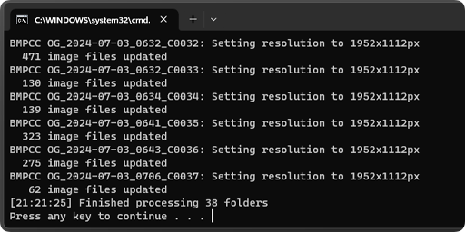
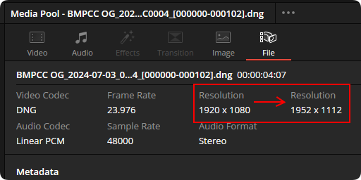
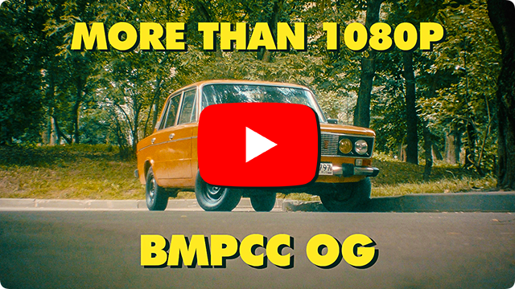

## BMPCC OG Full Res Tool

A simple automation tool to batch convert Blackmagic Pocket Cinema Camera Original CinemaDNG footage from 1920x1080 to 1952x1112, gaining extra resolution for stabilization. It also works for the OG Micro - don't change anything and just use the script as is.

 

A few extra pixels may not sound like much, but they allow stabilizing the footage while still providing a wider field of view compared to the original footage. Check out the video for comparisons and installation instructions.

[](https://www.youtube.com/watch?v=lVFtVLCurk4)

## Installation

1. **Download exiftool** (Windows Executable) from [exiftool.org](https://exiftool.org/).
2. **Unzip and rename** the downloaded file to `exiftool.exe`.
3. **Move** `exiftool.exe` to the `C:/Windows` folder.
4. **Paste** the code from <a href="https://github.com/Eloren1/bmpcc-og-full-res/raw/main/bmpcc-og-full-res.bat">this link</a> into a notepad and save it as `bmpcc-og-full-res.bat`.
5. **Place** the batch file into a folder where your BMPCC OG footage is located.

## Usage

1. **Folder structure** example:

```
📂 .../Downloads/ImportedFootage/
└── 🛠️ bmpcc-og-full-res.bat
└── 📂 BMPCC OG_2024-07-03_0356_C0000/
└── 📂 BMPCC OG_2024-07-03_0356_C0001/
└── 📂 BMPCC OG_2024-07-03_0357_C0002/
```

2. **Run** `bmpcc-og-full-res.bat` each time before importing new footage into DaVinci Resolve.
3. **Set zoom value** in DaVinci Resolve to `1.030x` to get the same field of view as before, or `1.014x` for the widest 16:9 possible.

## Resolutions

- BMPCC OG: 1920x1080 → 1952x1112 (1.014x zoom for 16:9)
- BMMCC OG: 1920x1080 → 1952x1104 (1.006x zoom for 16:9)
- BMCC 2.5K: already maxed out at 2432x1366

## Tasks

- [ ] Implement checks to verify if footage is from BMPCC OG
- [x] Check if footage already has 1952x1112 resolution